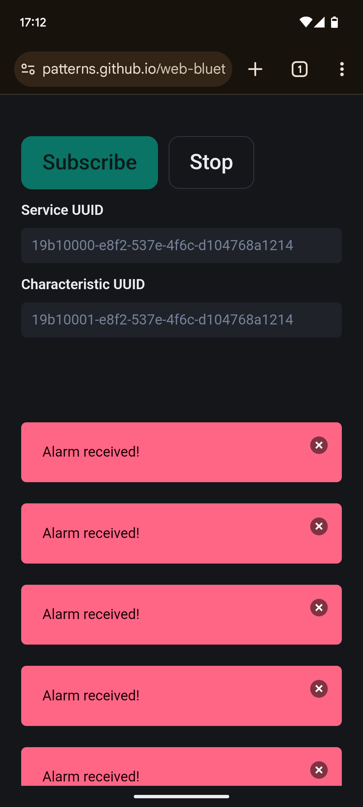

# Web Bluetooth

### What is this?
This is a demo of the BLE Notify support on the Nano 33 BLE.
 The Nano is the peripheral with the alarm service and alarm characteristic.
 Then when you navicate to this static HTML page on your mobile device's Chrome browser, it acts as the Android central role. Waiting for notifications from the Nano.


 
### Quickstart
0. You need a Edge Impulse project (or [use ours](https://studio.edgeimpulse.com/public/699161/live))
1. From Edge Impulse: Deployment, choose the Arduino library for the build target.
2. Add the resulting (.zip) file as a library in the Arduino workspace:
```bash
 arduino-cli lib install --zip-path ~/path/to/download/ei-<PROJECT_NAME>.zip
```
3. Find the sketch (.ino) in the library path:
```bash
 ls ~/Arduino/Libraries/<PROJECT_NAME>/examples/nano_ble33_sense/nano_ble33_sense_microphone
```
4. Make your changes for BLE (or [use ours](https://github.com/patterns/certification/blob/28fe69ef87690d60916bce50de26ca7d3f8f3eb2/ace/eep564/proj/nano_ble33_sense_microphone.ino))
5. Flash the sketch to the Nano:
```bash
 cd ~/Arduino/libraries/<PROJECT_NAME>/examples/nano_ble33_sense && \
    arduino-cli compile --fqbn arduino:mbed_nano:nano33ble nano_ble33_sense_microphone
 cd ~/Arduino/libraries/<PROJECT_NAME>/examples/nano_ble33_sense && \
    arduino-cli upload -p /dev/ttyACM0 --fqbn arduino:mbed_nano:nano33ble nano_ble33_sense_microphone
```
6. Start the serial comm to monitor the inference scores:
```bash
 arduino-cli monitor -p /dev/ttyACM0 --fqbn arduino:mbed_nano:nano33ble
```

### Credits
Bluetooth Notifications demo
 by [Google](https://github.com/project-idx/templates/tree/main/gemini)

Nano Bluetooth tutorial
 by [Arduino](https://docs.arduino.cc/tutorials/nano-33-ble-sense/ble-device-to-device/)
